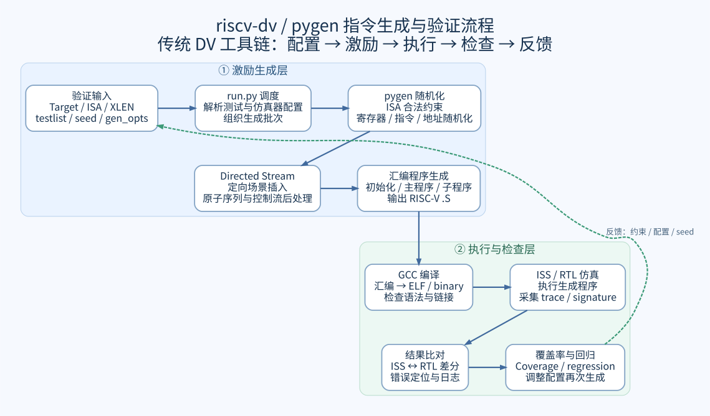
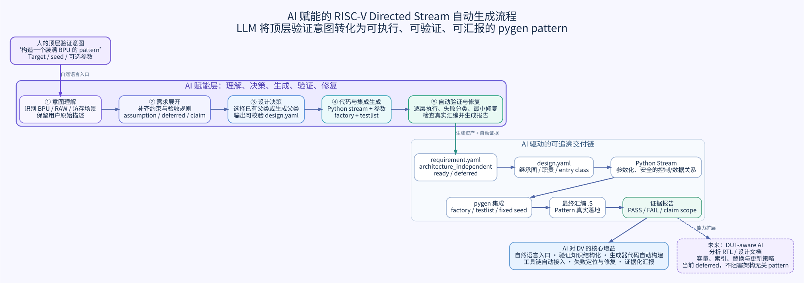

LLM Directed Stream Skill 使用指南
===================================

流程图概览
----------

Directed Stream Skill 顶层流程：

.. image:: _static/llm_end_to_end_verification_flow.svg
   :alt: LLM Directed Stream Skill 顶层流程
   :width: 100%

该图概括从自然语言验证需求到 Directed Stream 生成、集成、验证与交付的主流程。

传统 riscv-dv / pygen 工具流程：

AI 赋能的 directed stream Skill 流程：

``generate-riscv-directed-stream`` 是本仓库的项目级 Codex skill，用来把自然语言
验证需求转换为新的 pygen directed instruction stream，并完成继承设计、代码生成、
factory 注册、随机化、汇编生成和结果检查。

Skill 生成的是可参数化的指令流生成器，而不是一份写死的汇编 testcase。

位置与前置条件
--------------

Skill 位于：

.. code-block:: text

   .codex/skills/generate-riscv-directed-stream/

使用前应满足：

* 在本仓库根目录启动 Codex；
* Python 能够导入 ``vsc`` 和 ``yaml``；
* 使用 ``pyflow`` 时不需要商业 RTL 仿真器；
* 如果需要编译或 ISS 仿真，则额外配置 RISC-V GCC 和相应 ISS；
* 工作区存在未提交修改时，应要求 Codex 保留无关修改。

快速开始
--------

在 Codex 对话中显式引用 skill，并描述 pattern：

.. code-block:: text

   使用 $generate-riscv-directed-stream，为 RV32IMC 创建一个整数 ALU RAW
   directed stream。生成 4 到 8 条 ADD、SUB、XOR、OR、AND 指令，要求每条
   指令的 rs1 使用上一条指令的 rd。不能使用 ZERO 和 reserved_regs。
   插入频率设为 20/1000，固定 seed 123。请生成类、注册 factory、运行
   run.py --steps gen，并检查最终汇编中的 RAW 链。

建议明确要求 Codex 输出每一层的 ``PASS``、``FAIL`` 或 ``NOT RUN``，避免仅凭
Python 语法正确就宣称 pattern 已完成。

推荐需求格式
------------

自然语言至少说明以下内容：

* pattern 的指令顺序和数据关系；
* 允许随机化的维度和范围；
* ISA、XLEN 和特权级要求；
* 禁止使用的寄存器、指令或地址；
* 指令流长度、插入频率和 seed；
* 如何从最终汇编判断 pattern 成功。

完整示例：

.. code-block:: text

   使用 $generate-riscv-directed-stream 创建同地址 store→load RAW pattern：

   - target 为 rv32imc；
   - 生成 4 到 10 组访问；
   - store 和后续 load 必须使用相同 base register 和 offset；
   - 访问宽度固定为 word，地址必须对齐；
   - 两条访存之间允许插入 0 到 2 条无关整数指令；
   - 不允许 ZERO 或 cfg.reserved_regs 作为可写寄存器；
   - 插入频率为 20/1000，seed 为 123；
   - 自动检查最终汇编中至少存在 4 组同地址 store/load；
   - 先设计继承结构，再决定是否使用 riscv_mem_access_stream。

顶层需求自动展开
----------------

如果只提供“构造一个装满 BPU 的 pattern”这类顶层意图，Skill 会先生成结构化
``requirement.yaml``，再决定是否进入类设计。可单独运行：

.. code-block:: bash

   python3 .codex/skills/generate-riscv-directed-stream/scripts/elaborate_requirement.py \
     --intent "构造一个装满 BPU 的 pattern" \
     --target rv32imc \
     --seed 123 \
     --output llm_generated/bpu_pressure/requirement.yaml

生成结果保留原始描述，并区分 ``field_sources``、``assumptions`` 和
``unresolved``。``review`` 控制后续流程：

* ``ready``：需求完整，或已明确采用架构无关模式，可以进入继承设计；
* ``needs_review`` 且 ``blocking: false``：可以按明确假设生成，汇报时必须列出假设；
* ``blocked``：缺少指令语义或汇编验收条件，不能开始生成类。

BPU profile 默认使用 ``generation_mode: architecture_independent``。DUT 容量、索引和
更新策略进入 ``deferred``，不会阻塞当前 pattern；只有进入 DUT-aware 容量、alias 或
训练效果验证时才需要解决。最终汇编只作为“刺激结构生成成功”的证据，不将其解释成
DUT 内部 BPU 已满。
用户可通过 ``--branch-sites``、``--unique-targets`` 和
``--maximum-branch-distance`` 覆盖默认压力规模。

Skill 的执行流程
----------------

顶层流程分为六个阶段：

#. **验证需求**：用户用自然语言描述目标场景、目标 ISA、参数和预期结果。
#. **需求结构化**：Skill 将意图整理为明确的约束、假设和验收标准；存在阻塞项时先请求确认。
#. **生成 Directed Stream**：设计合适的继承关系，生成可配置、可复用的 Pattern。
#. **集成并运行**：接入 pygen，配置 factory 和 testlist，使用固定 seed 生成测试。
#. **验证与反馈**：逐层检查设计、随机化、集成和最终汇编；失败时定位并修复最小责任项。
#. **交付验证资产**：报告生成物、运行参数、验证状态和代表性汇编证据。

前五个阶段对应页面顶部的流程图。验证结果不满足预期时，Skill 返回需求结构化或
Pattern 生成阶段调整约束和方案，而不是直接扩大修改范围。

关键中间资产包括：

* ``requirement.yaml``：结构化需求、假设和验收条件；
* ``design.yaml``：继承关系、职责和 entry class；
* Python stream 与 JSON/YAML：Pattern 实现及可调参数；
* ``testlist.yaml`` 与固定 seed：可复现运行入口；
* 最终 ``.S`` 和检查报告：语义验收证据。

继承策略
--------

Skill 不要求所有类都继承 ``riscv_mem_access_stream``。它应先产生
``design.yaml``，再根据需求选择以下方式。

直接继承通用基类
~~~~~~~~~~~~~~~~

适用于 ALU dependency、跳转组合等不依赖内存区域的 pattern：

.. code-block:: python

   class riscv_llm_alu_raw_stream(riscv_directed_instr_stream):
       ...

继承已有能力类
~~~~~~~~~~~~~~

需要 data page、memory region 或基地址初始化时，可复用：

.. code-block:: python

   class riscv_llm_same_address_stream(riscv_mem_access_stream):
       ...

继承已有具体 stream
~~~~~~~~~~~~~~~~~~~

只有当已有类的约束和生命周期与需求兼容时才使用：

.. code-block:: python

   class riscv_llm_narrow_ls_stream(riscv_load_store_rand_instr_stream):
       ...

生成新的父类
~~~~~~~~~~~~

多个 pattern 共享寄存器选择或 dependency 构造逻辑时，可以生成公共父类：

.. code-block:: python

   class riscv_llm_dependency_stream_base(riscv_directed_instr_stream):
       ...

   class riscv_llm_alu_raw_stream(riscv_llm_dependency_stream_base):
       ...

继承图必须无环，entry class 必须最终连接到合法 pygen stream 根类，并且只有
entry class 注册进 factory。

生成物位置
----------

默认代码位置：

.. code-block:: text

   pygen/pygen_src/llm_patterns/
   ├── __init__.py
   ├── riscv_llm_<pattern>_stream.py
   └── riscv_llm_<pattern>_stream.json

一次运行的需求、设计和证据建议放在：

.. code-block:: text

   llm_generated/<pattern>/
   ├── requirement.yaml
   ├── design.yaml
   ├── testlist.yaml
   ├── smoke-result.json
   ├── smoke.S
   └── out/
       ├── seed.yaml
       ├── sim_<test>.log
       └── asm_test/<test>.S

逐层手工验证
------------

以下命令既可用于人工排查，也会被 skill 自动调用。请从仓库根目录执行。

验证继承设计
~~~~~~~~~~~~

.. code-block:: bash

   python3 .codex/skills/generate-riscv-directed-stream/scripts/validate_design.py \
     llm_generated/alu_raw/design.yaml

验证生成类的静态契约
~~~~~~~~~~~~~~~~~~~~

.. code-block:: bash

   python3 .codex/skills/generate-riscv-directed-stream/scripts/validate_pattern.py \
     pygen/pygen_src/llm_patterns/riscv_llm_alu_raw_stream.py \
     --class-name riscv_llm_alu_raw_stream \
     --base-class riscv_directed_instr_stream \
     --config pygen/pygen_src/llm_patterns/riscv_llm_alu_raw_stream.json

直接 randomize
~~~~~~~~~~~~~~

这一步尚未修改 factory，用于隔离生成类本身的问题：

.. code-block:: bash

   python3 .codex/skills/generate-riscv-directed-stream/scripts/smoke_test_pattern.py \
     --repo-root . \
     --module pygen_src.llm_patterns.riscv_llm_alu_raw_stream \
     --class-name riscv_llm_alu_raw_stream \
     --target rv32imc \
     --seed 123 \
     --json-output llm_generated/alu_raw/smoke-result.json \
     --asm-output llm_generated/alu_raw/smoke.S

检查或应用 factory 注册
~~~~~~~~~~~~~~~~~~~~~~~

先检查：

.. code-block:: bash

   python3 .codex/skills/generate-riscv-directed-stream/scripts/integrate_factory.py \
     --utils pygen/pygen_src/riscv_utils.py \
     --module pygen_src.llm_patterns.riscv_llm_alu_raw_stream \
     --class-name riscv_llm_alu_raw_stream \
     --check

确认 smoke test 通过后再注册：

.. code-block:: bash

   python3 .codex/skills/generate-riscv-directed-stream/scripts/integrate_factory.py \
     --utils pygen/pygen_src/riscv_utils.py \
     --module pygen_src.llm_patterns.riscv_llm_alu_raw_stream \
     --class-name riscv_llm_alu_raw_stream \
     --apply

``--apply`` 是幂等操作，重复执行不会重复添加 import 或映射。

生成 testlist
~~~~~~~~~~~~~

.. code-block:: bash

   python3 .codex/skills/generate-riscv-directed-stream/scripts/generate_testlist.py \
     llm_generated/alu_raw/requirement.yaml \
     llm_generated/alu_raw/testlist.yaml

执行 pygen
~~~~~~~~~~

.. code-block:: bash

   python3 run.py \
     --simulator pyflow \
     --target rv32imc \
     --testlist llm_generated/alu_raw/testlist.yaml \
     --test riscv_llm_alu_raw_test \
     --steps gen \
     --seed 123 \
     --output llm_generated/alu_raw/out \
     --noclean

检查最终汇编
~~~~~~~~~~~~

ALU RAW：

.. code-block:: bash

   python3 .codex/skills/generate-riscv-directed-stream/scripts/inspect_asm.py \
     llm_generated/alu_raw/out/asm_test/riscv_llm_alu_raw_test_0.S \
     --expect alu-raw-chain \
     --minimum 4

同地址 store/load：

.. code-block:: bash

   python3 .codex/skills/generate-riscv-directed-stream/scripts/inspect_asm.py \
     <generated.S> \
     --expect store-load-same-address \
     --minimum 4 \
     --maximum-distance 2

当前 ALU RAW 示例
-----------------
仓库已包含一个完整示例：

* ``llm_generated/alu_raw/requirement.yaml``：自然语言需求的结构化结果；
* ``llm_generated/alu_raw/design.yaml``：直接继承通用基类的设计；
* ``pygen/pygen_src/llm_patterns/riscv_llm_alu_raw_stream.py``：生成类；
* ``llm_generated/alu_raw/out/asm_test/riscv_llm_alu_raw_test_0.S``：真实输出。

固定 seed 123 的端到端测试已生成两个 directed stream，其中检测到一条 8 级
ALU RAW 链。

常见问题
--------

``Cannot generate random instruction``
~~~~~~~~~~~~~~~~~~~~~~~~~~~~~~~~~~~~~~

确认 smoke test 在 ``riscv_instr.create_instr_list(cfg)`` 前导入 target 支持的全部
ISA 模块。仓库提供的 smoke 工具已经包含该步骤。

相同 opcode 的旧指令被后续随机化覆盖
~~~~~~~~~~~~~~~~~~~~~~~~~~~~~~~~~~~~~~

``riscv_instr.get_instr()`` 返回浅拷贝。需要保存多个相同 opcode 时，应对返回对象
执行 ``copy.deepcopy()`` 后再随机化。

``factory`` 找不到类
~~~~~~~~~~~~~~~~~~~~

确认生成模块能够直接 import，并检查 ``riscv_utils.py`` 同时包含 import 和 factory
字典映射。只注册 ``design.yaml`` 中的 entry class。

``randomize()`` 成功但 pattern 不正确
~~~~~~~~~~~~~~~~~~~~~~~~~~~~~~~~~~~~~~~

这属于 intent mismatch。检查最终 ``.S`` 中的寄存器、地址和顺序关系，不要只统计
指令名称。必要时为新 pattern 扩展 ``inspect_asm.py``。

``run.py`` 显示 Python ``SyntaxWarning``
~~~~~~~~~~~~~~~~~~~~~~~~~~~~~~~~~~~~~~~~

当前 ``run.py`` 中部分旧正则表达式会在新 Python 版本下产生 invalid escape sequence
警告。只要返回码、生成日志和 ``TEST GENERATION DONE`` 正常，这些警告不等同于
pattern 生成失败。

建议的使用顺序
--------------

首次使用时按以下顺序推进：

#. 用 ALU RAW 示例确认环境可用；
#. 创建一个直接继承通用基类的新 pattern；
#. 创建一个复用 ``riscv_mem_access_stream`` 的内存 pattern；
#. 最后尝试生成公共父类和多个子 pattern；
#. 每种新 pattern 都补充对应的汇编 intent checker。

完成标准
--------

只有以下各项均通过时，才能把 pattern 标记为端到端成功：

* design validation；
* source contract 和 Python compile；
* pygen import、实例化和 ``randomize()``；
* factory 注册；
* ``run.py --steps gen``；
* 真实 ``.S`` 文件生成；
* pattern 专用语义检查。
